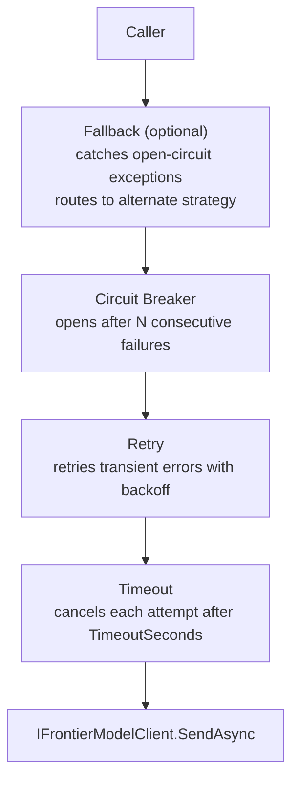
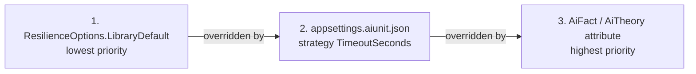

# SharpNinja.aiUnit

xUnit extension for frontier-model regression testing, AI-assisted code review, and
workspace strategy management. Write tests that call real AI models, auto-skip when
no model is configured, and tolerate transient failures through a built-in resilience
pipeline.

[](https://www.nuget.org/packages/SharpNinja.aiUnit)
[](LICENSE)

---

## Contents

- [Quick Start](#quick-start)
- [Strategy Configuration](#strategy-configuration)
- [Writing AI Tests](#writing-ai-tests)
- [Resilience Pipeline](#resilience-pipeline)
- [Review Attributes](#review-attributes)
- [JSON Assertions](#json-assertions)
- [aiunit CLI Tool](#aiunit-cli-tool)
- [Advanced Usage](#advanced-usage)
- [License](#license)

---

## Quick Start

### 1. Install the NuGet package

```
dotnet add package SharpNinja.aiUnit
```

### 2. Add a strategy config file

Create `appsettings.aiunit.json` in the test project and set it to copy to the output
directory (`CopyToOutputDirectory: PreserveNewest`). Pick any strategy kind that
matches your setup:

```json
{
  "AiUnit": {
    "ActiveStrategy": "claude",
    "Strategies": {
      "claude": {
        "Kind": "cli",
        "Command": "claude",
        "Model": "claude-sonnet-4-6",
        "TimeoutSeconds": 900,
        "Temperature": 0.0,
        "Description": "Claude Code CLI."
      }
    }
  }
}
```

### 3. Write your first test

```csharp
using SharpNinja.AiUnit.Frontier;
using SharpNinja.AiUnit.Xunit;

public class MyAiTests
{
    [AiFact]
    public async Task Model_CanAnswerSimpleQuestion()
    {
        var client = AiStrategyFixture.Default.Client!;
        var response = await client.SendAsync(
            new FrontierRequest("You are a helpful assistant.", "What is 2 + 2?"));

        Assert.Null(response.Error);
        Assert.Contains("4", response.Text!);
    }
}
```

The `[AiFact]` attribute auto-skips the test if no strategy resolves, so your CI
pipeline never fails on machines without an API key configured.

```
dotnet test
```

---

## Strategy Configuration

### Config file

aiUnit looks for `appsettings.aiunit.json` starting from the test output directory and
walking up to parent directories. The file selects a strategy by name; the active
strategy is resolved at process start and shared by all tests in the run.

```json
{
  "AiUnit": {
    "ActiveStrategy": "codex-subscription",
    "Strategies": {
      "codex-subscription": {
        "Kind": "cli",
        "Command": "codex",
        "Model": "(cli-managed)",
        "TimeoutSeconds": 900,
        "Temperature": 0.0,
        "Description": "Codex CLI using the logged-in subscription."
      },
      "claude": {
        "Kind": "cli",
        "Command": "claude",
        "Model": "claude-sonnet-4-6",
        "TimeoutSeconds": 900,
        "Temperature": 0.0,
        "Description": "Claude Code CLI."
      },
      "grok-build": {
        "Kind": "cli",
        "Command": "SharpNinja.AiUnit.GrokBridge.exe",
        "Model": "grok-build",
        "TimeoutSeconds": 900,
        "Temperature": 0.0,
        "Description": "Grok Build CLI using the logged-in Grok account."
      },
      "grok": {
        "Kind": "openai-compatible",
        "BaseUrl": "https://api.x.ai",
        "Model": "grok-4",
        "ApiKeyEnvVar": "XAI_API_KEY",
        "TimeoutSeconds": 1800,
        "Temperature": 0.0,
        "Description": "xAI Grok-4 via OpenAI-compatible API."
      },
      "gemini": {
        "Kind": "gemini",
        "BaseUrl": "https://generativelanguage.googleapis.com",
        "Model": "gemini-2.5-flash",
        "ApiKeyEnvVar": "GOOGLE_API_KEY",
        "TimeoutSeconds": 600,
        "Temperature": 0.0,
        "Description": "Google Gemini Generative Language API."
      },
      "claude-api": {
        "Kind": "anthropic",
        "BaseUrl": "https://api.anthropic.com",
        "Model": "claude-opus-4-5",
        "ApiKeyEnvVar": "ANTHROPIC_API_KEY",
        "TimeoutSeconds": 600,
        "Temperature": 0.0,
        "Description": "Anthropic HTTP API (no CLI required)."
      }
    }
  }
}
```

### Strategy kinds

| Kind | Description | Auth |
|------|-------------|------|
| `cli` | Spawns the configured `Command` executable and parses its output. | Handled by the CLI tool. `ApiKeyEnvVar` is ignored. |
| `anthropic` | Calls `/v1/messages` on the Anthropic API. | `ApiKeyEnvVar` or `AIUNIT_API_KEY`. |
| `openai-compatible` | Calls `/v1/chat/completions` on any OpenAI-compatible endpoint. | `ApiKeyEnvVar` or `AIUNIT_API_KEY`. |
| `gemini` | Calls the Google Generative Language API. | `ApiKeyEnvVar` or `AIUNIT_API_KEY`. |

### Environment-variable overrides

All config values can be overridden at run time:

| Variable | Overrides |
|----------|-----------|
| `AIUNIT_STRATEGY` | `ActiveStrategy` |
| `AIUNIT_KIND` | strategy `Kind` |
| `AIUNIT_BASE_URL` | strategy `BaseUrl` |
| `AIUNIT_MODEL` | strategy `Model` |
| `AIUNIT_COMMAND` | strategy `Command` |
| `AIUNIT_API_KEY` | strategy `ApiKeyEnvVar` value |
| `AIUNIT_TIMEOUT_SECONDS` | strategy `TimeoutSeconds` |
| `AIUNIT_TEMPERATURE` | strategy `Temperature` |

`SharpNinja.AiUnit.GrokBridge.exe` follows the same model contract as other
strategies: the resolved strategy `Model`, or `AIUNIT_MODEL` override, is passed
to Grok as `grok --model`.

### CLI-strategy setup

Before running tests with a CLI strategy, authenticate the tool:

```powershell
# Claude Code
$env:ANTHROPIC_API_KEY = "<key>"
# or use: claude auth login

# Codex CLI
codex login

# Copilot CLI
$env:COPILOT_API_KEY = "<key>"

# Grok Build CLI
# Authenticate with your installed Grok Build CLI before selecting grok-build.
```

For HTTP strategies, set the variable named in `ApiKeyEnvVar`:

```powershell
$env:ANTHROPIC_API_KEY = "<key>"
$env:XAI_API_KEY       = "<key>"
$env:GOOGLE_API_KEY    = "<key>"
```

---

## Writing AI Tests

### `[AiFact]` and `[AiTheory]`

Both attributes extend their xUnit counterparts and add an auto-skip guard: if no
strategy resolves, the test is marked **skipped** (not failed) with a clear reason.

```csharp
using SharpNinja.AiUnit.Frontier;
using SharpNinja.AiUnit.Xunit;

public class IntentExtractionTests
{
    [AiFact]
    public async Task Model_ExtractsIntentAsJson()
    {
        var client = AiStrategyFixture.Default.Client!;

        var response = await client.SendAsync(new FrontierRequest(
            SystemPrompt: "Extract user intent. Return JSON: {\"intent\": \"<value>\"}",
            UserMessage: "I want to book a flight to Seattle next Tuesday.",
            RequireJsonOutput: true));

        Assert.Null(response.Error);

        using var doc = System.Text.Json.JsonDocument.Parse(response.Text!);
        Assert.Equal("book_flight",
            doc.RootElement.GetProperty("intent").GetString());
    }

    [AiTheory]
    [InlineData("Book a flight to Paris", "book_flight")]
    [InlineData("Cancel my reservation #4821", "cancel_reservation")]
    public async Task Model_ClassifiesIntents(string input, string expectedIntent)
    {
        var client = AiStrategyFixture.Default.Client!;

        var response = await client.SendAsync(new FrontierRequest(
            SystemPrompt: "Return JSON: {\"intent\": \"<value>\"}",
            UserMessage: input,
            RequireJsonOutput: true));

        Assert.Null(response.Error);
        using var doc = System.Text.Json.JsonDocument.Parse(response.Text!);
        Assert.Equal(expectedIntent,
            doc.RootElement.GetProperty("intent").GetString());
    }
}
```

### Shared fixture

For xUnit class fixtures or collection fixtures, access the process-wide singleton
directly. Every test in the run shares the same resolved client:

```csharp
public class FixtureTests : IClassFixture<AiStrategyFixture>
{
    private readonly AiStrategyFixture _fixture;

    public FixtureTests(AiStrategyFixture _) =>
        _fixture = AiStrategyFixture.Default;

    [AiFact]
    public async Task Fixture_ClientResolves()
    {
        Assert.True(_fixture.IsResolved, _fixture.SkipReason);

        var response = await _fixture.Client!.SendAsync(
            new FrontierRequest("You are an echo bot.", "Echo: hello"));

        Assert.Null(response.Error);
    }
}
```

### FrontierRequest options

```csharp
new FrontierRequest(
    SystemPrompt:     "You are a strict JSON validator.",
    UserMessage:      "Validate this payload: ...",
    RequireJsonOutput: true,       // hint to the adapter to use JSON mode
    MaxTokens:        512,         // optional token cap
    Temperature:      0.1,         // optional override
    Attachments:      [            // optional vision attachments
        new FrontierAttachment("image/png", "screenshot.png", imageBytes)
    ]
)
```

### FrontierResponse

```csharp
FrontierResponse response = await client.SendAsync(request);

// Success path
string text      = response.Text!;             // model output
long   latencyMs = response.LatencyMs;         // wall-clock ms
int    input     = response.TokenUsage.InputTokens;
int    output    = response.TokenUsage.OutputTokens;

// Error path (never throws; always check)
if (response.Error is { } err)
{
    // err.ErrorCode: "auth" | "rate_limit" | "timeout" | "server_error"
    //               | "network" | "malformed_response" | "circuit_open"
    //               | "AttachmentTooLarge" | "unexpected"
    Skip.If(true, $"AI call failed: {err.ErrorCode} - {err.Message}");
}
```

---

## Resilience Pipeline

Every AI call is automatically wrapped in a [Polly v8](https://github.com/App-vNext/Polly)
resilience pipeline. The pipeline is enabled by default using safe library defaults and
requires no configuration to get started.

### Pipeline stages

The pipeline applies four stages in order, outermost first:



| Stage | Default behavior |
|-------|-----------------|
| **Timeout** | Cancels the attempt after `TimeoutSeconds`. Per-attempt, not total call time. When the timeout fires, the error code is `"timeout"`. |
| **Retry** | Retries up to `MaxRetries` times on transient errors. Uses `RetryBackoff` with optional jitter. Delay starts at `RetryBaseDelayMs`. |
| **Circuit Breaker** | Opens after `BreakAfterConsecutiveFailures` consecutive failures. Stays open for `BreakDurationSeconds`. While open, calls return `"circuit_open"` without invoking the model. |
| **Fallback** | Only active when `FallbackStrategy` is set. When the circuit is open, routes the call to the named fallback strategy instead of returning an error. |

### Configuration layers

Resilience options are resolved at three levels, with the most specific winning:



Only `TimeoutSeconds` flows from `appsettings.aiunit.json` into the pipeline. All
other options use library defaults unless overridden per-test.

### Library defaults

| Option | Default | Notes |
|--------|---------|-------|
| `ResilienceEnabled` | `true` | Set `false` to bypass the pipeline entirely. |
| `TimeoutSeconds` | 180 s | Overridden by strategy `TimeoutSeconds` from config. |
| `MaxRetries` | 1 | 0 means no retry; Polly skips the retry stage entirely. |
| `RetryBaseDelayMs` | 2000 ms | Starting delay before the first retry. |
| `RetryBackoff` | `"exponential"` | See backoff reference below. |
| `BreakAfterConsecutiveFailures` | 5 | Consecutive failures before circuit opens. |
| `BreakDurationSeconds` | 30 s | How long the circuit stays open before allowing one probe. |
| `FallbackStrategy` | `null` | Name of a configured strategy to use when circuit is open. |

### Strategy-level timeout

The `TimeoutSeconds` value from `appsettings.aiunit.json` is the primary timeout knob.
Set it to match your model's expected response time:

```json
{
  "AiUnit": {
    "Strategies": {
      "claude": {
        "Kind": "cli",
        "Command": "claude",
        "TimeoutSeconds": 900,
        "Temperature": 0.0
      },
      "gemini-flash": {
        "Kind": "gemini",
        "Model": "gemini-2.5-flash",
        "ApiKeyEnvVar": "GOOGLE_API_KEY",
        "TimeoutSeconds": 60
      }
    }
  }
}
```

With `TimeoutSeconds: 900`, every attempt may run for up to 15 minutes before Polly
cancels it and counts it as a timeout failure.

### Retry and backoff

When a transient error occurs, the retry stage waits before the next attempt.

**Backoff strategies:**

| `RetryBackoff` | Behavior | Delays (base=2000 ms, with jitter) |
|----------------|----------|-----------------------------------|
| `"exponential"` | Delay doubles each attempt; jitter added | ~2 s, ~4 s, ~8 s, ... |
| `"linear"` | Delay grows linearly | ~2 s, ~4 s, ~6 s, ... |
| `"constant"` | Same delay every attempt; no jitter | 2 s, 2 s, 2 s, ... |

Jitter (exponential only) spreads retries across a distributed test run to avoid the
thundering-herd problem. With `RetryBaseDelayMs: 2000` and `MaxRetries: 1`, a single
transient failure adds roughly 2 seconds before the retry attempt.

**Transient errors (retried):**

| Error code | Cause |
|------------|-------|
| `server_error` | HTTP 5xx or equivalent CLI failure |
| `network` | Connection failure, DNS failure |
| `timeout` | Per-attempt timeout fired |
| `malformed_response` | Model returned unparseable output |
| `empty_response` | Model returned an empty or null response |

**Non-transient errors (not retried):**

| Error code | Cause |
|------------|-------|
| `auth` | Invalid or expired API key |
| `rate_limit` | HTTP 429 or equivalent |
| `AttachmentTooLarge` | Attachment exceeded the 5 MB limit |
| `spawn_failed` | CLI executable not found or failed to start |

Non-transient errors are surfaced immediately to the caller. Retrying cannot fix an
authentication failure or a too-large attachment.

### Circuit breaker behavior

The circuit breaker tracks whether the last N calls all failed. When the failure ratio
reaches 100% over the minimum throughput window, the circuit opens.

**Open state:** calls return `FrontierError("circuit_open", ...)` without touching the
model. This protects a failing endpoint from a flood of parallel test calls.

**Half-open probe:** after `BreakDurationSeconds`, the circuit enters half-open and
allows one probe call. If it succeeds, the circuit closes. If it fails, the circuit
opens again for another `BreakDurationSeconds`.

**Tuning for test suites:** with `BreakAfterConsecutiveFailures: 5` and a fast test
suite, the circuit can open in seconds. If parallel test execution causes spurious
circuit trips, increase `BreakAfterConsecutiveFailures` or set it per-test for
stability-sensitive tests.

### Fallback strategy

When `FallbackStrategy` names a configured strategy, the pipeline routes to that
strategy whenever the primary circuit is open:

```json
{
  "AiUnit": {
    "ActiveStrategy": "grok",
    "Strategies": {
      "grok": {
        "Kind": "openai-compatible",
        "BaseUrl": "https://api.x.ai",
        "Model": "grok-4",
        "ApiKeyEnvVar": "XAI_API_KEY",
        "TimeoutSeconds": 120
      },
      "claude": {
        "Kind": "cli",
        "Command": "claude",
        "TimeoutSeconds": 900
      }
    }
  }
}
```

```csharp
[AiFact]
public async Task Analysis_WithFallback()
{
    var opts = AiStrategyFixture.Default.StrategyResilienceOptions with
    {
        FallbackStrategy = "claude",        // fall back to Claude if Grok circuit opens
        BreakAfterConsecutiveFailures = 3,
        BreakDurationSeconds = 60
    };
    var response = await AiStrategyFixture.Default.ExecuteAsync(
        new FrontierRequest("sys", "user"), opts);

    Assert.Null(response.Error);
}
```

Fallback invocation is transparent: the response comes back as if the primary strategy
had succeeded, with no change to the calling code.

### Per-test configuration

Override any option for a single test by building a modified `ResilienceOptions` from
the strategy baseline and passing it to `ExecuteAsync`:

```csharp
[AiFact]
public async Task LongRunningAnalysis()
{
    var opts = AiStrategyFixture.Default.StrategyResilienceOptions with
    {
        TimeoutSeconds = 600,       // 10-minute budget for this specific test
        MaxRetries = 3,             // extra retries for a slow or flaky endpoint
        RetryBaseDelayMs = 5000,    // wait 5 s before first retry
        RetryBackoff = "constant"   // predictable delay, no jitter
    };

    var response = await AiStrategyFixture.Default.ExecuteAsync(
        new FrontierRequest("Analyze this large codebase thoroughly.", codeInput),
        opts);

    Assert.Null(response.Error);
}
```

`StrategyResilienceOptions` is the resolved baseline (strategy `TimeoutSeconds` +
library defaults). The `with` expression overrides only the fields you specify; all
others inherit from the strategy.

Available options:

| Property | Type | Description |
|----------|------|-------------|
| `ResilienceEnabled` | `bool` | `false` bypasses the entire pipeline for this call. |
| `TimeoutSeconds` | `int` | Per-attempt timeout in seconds. |
| `MaxRetries` | `int` | Retry attempts on transient failure. `0` skips the retry stage. |
| `RetryBaseDelayMs` | `int` | Base delay in milliseconds before the first retry. |
| `RetryBackoff` | `string` | `"exponential"`, `"linear"`, or `"constant"`. |
| `BreakAfterConsecutiveFailures` | `int` | Consecutive failures before the circuit opens. |
| `BreakDurationSeconds` | `int` | Seconds the circuit stays open. |
| `FallbackStrategy` | `string?` | Named strategy to route to when circuit is open. |

### Common scenarios

**Slow model - extend the timeout:**
```csharp
[AiFact]
public async Task DeepAnalysis_ExtendedTimeout()
{
    var opts = AiStrategyFixture.Default.StrategyResilienceOptions with
        { TimeoutSeconds = 600 };
    var resp = await AiStrategyFixture.Default.ExecuteAsync(req, opts);
}
```

**Flaky endpoint - more retries with longer delays:**
```csharp
[AiFact]
public async Task FlakyEndpoint_ExtraRetries()
{
    var opts = AiStrategyFixture.Default.StrategyResilienceOptions with
    {
        MaxRetries = 5,
        RetryBaseDelayMs = 10_000,
        RetryBackoff = "exponential"
    };
    var resp = await AiStrategyFixture.Default.ExecuteAsync(req, opts);
}
```

**Integration test - isolate from shared circuit state:**
```csharp
[AiFact]
public async Task IntegrationTest_IsolatedCircuit()
{
    // High threshold so this test doesn't trip the shared breaker.
    var opts = AiStrategyFixture.Default.StrategyResilienceOptions with
        { BreakAfterConsecutiveFailures = 100 };
    var resp = await AiStrategyFixture.Default.ExecuteAsync(req, opts);
}
```

**No pipeline - direct call:**
```csharp
[AiFact]
public async Task TimingBenchmark_NoPipeline()
{
    // Bypass everything; raw client call for latency measurement.
    var opts = AiStrategyFixture.Default.StrategyResilienceOptions with
        { ResilienceEnabled = false };
    var resp = await AiStrategyFixture.Default.ExecuteAsync(req, opts);
}
```

**Fallback to cheaper model:**
```csharp
[AiFact]
public async Task CostSensitive_FallsBackToFlash()
{
    var opts = AiStrategyFixture.Default.StrategyResilienceOptions with
    {
        FallbackStrategy = "gemini-flash",
        BreakAfterConsecutiveFailures = 2
    };
    var resp = await AiStrategyFixture.Default.ExecuteAsync(req, opts);
    Assert.Null(resp.Error);
}
```

---

## Review Attributes

Review attributes generate xUnit data rows that call a frontier model and pass the
result JSON to the test method. They are stackable and support single or multiple
agents.

### Available attributes

| Attribute | Built-in prompt |
|-----------|----------------|
| `[AiCodeReview]` | Structured code quality, correctness, and security analysis. |
| `[AiPlanReview]` | Implementation plan feasibility and completeness review. |
| `[AiProjectReview]` | High-level project health and architecture assessment. |

### Basic usage

```csharp
using System.Text.Json;
using SharpNinja.AiUnit.Review;
using Xunit;

public class ReviewTests
{
    [Theory]
    [AiCodeReview]
    public void CodeReview_NoBlockingFindings(string prompt, string resultJson)
    {
        using var doc = JsonDocument.Parse(resultJson);
        var root = doc.RootElement;

        Assert.Equal("aiunit.review.findings.v1",
            root.GetProperty("schemaVersion").GetString());

        var blocking = root
            .GetProperty("findings")
            .EnumerateArray()
            .Where(f => f.GetProperty("severity").GetString() is "critical" or "high")
            .ToArray();

        Assert.Empty(blocking);
    }
}
```

### Custom prompt

Pass a string to override the built-in prompt:

```csharp
[AiCodeReview("Focus specifically on error-handling coverage and null-safety.")]
public void Review_NullSafety(string prompt, string resultJson) { ... }
```

### Selecting an agent

```csharp
// Single named strategy
[AiCodeReview(Agent = "claude")]

// Multiple agents - findings are aggregated
[AiCodeReview(Agents = new[] { "claude", "codex-subscription" })]

// Inline agent (no appsettings entry required)
[AiCodeReview(Kind = "cli", Command = "claude", Model = "claude-opus-4-5")]
```

### Review result JSON schema

The `resultJson` parameter always conforms to `aiunit.review.findings.v1`:

```json
{
  "schemaVersion": "aiunit.review.findings.v1",
  "reviewType": "code",
  "status": "fail",
  "summary": "One high-severity issue found.",
  "reviewedScope": "src/MyProject/Serializer.cs",
  "agent": {
    "name": "codex-subscription",
    "provider": "codex-subscription:codex",
    "model": "(cli-managed)"
  },
  "findings": [
    {
      "severity": "high",
      "category": "correctness",
      "title": "Missing null check on optional payload",
      "detail": "ReadPayload() dereferences .Value without checking JsonValueKind.Null.",
      "recommendation": "Add a null-kind guard before accessing .Value.",
      "filePath": "src/MyProject/Serializer.cs",
      "line": 42,
      "ruleId": "MY-NULL-001",
      "confidence": 0.92,
      "agent": "codex-subscription"
    }
  ],
  "runLog": {
    "path": "C:\\repo\\aiunit-results\\aiunit-review-code-20260530T120000.000Z.json",
    "url": "https://logs.example/runs/aiunit-review-code-20260530T120000.000Z.json",
    "markdownPath": "C:\\repo\\aiunit-results\\aiunit-review-code-20260530T120000.000Z.md",
    "startedUtc": "2026-05-30T12:00:00.0000000+00:00"
  }
}
```

| Field | Values | Meaning |
|-------|--------|---------|
| `status` | `pass` / `fail` / `error` | `pass` = no blocking findings; `fail` = issues found; `error` = review could not complete |
| `severity` | `critical` / `high` / `medium` / `low` / `info` | Finding severity |
| `category` | `correctness` / `security` / `performance` / `style` / `design` | Finding category |
| `runLog.path` | local file path | Path to the persisted JSON run log for this review run (always present) |
| `runLog.url` | URL | Online link to the run log (present only when an online base URL is configured) |
| `runLog.markdownPath` | local file path | Path to the human-readable Markdown companion of the run log (present when the file sink wrote one) |

### Run logs and the results directory

Every review writes a run-log result file and embeds a `runLog` reference (above)
into its `resultJson`. Each file is named
`aiunit-review-{type}-{yyyyMMddTHHmmss.fffZ}.json` using the UTC start time of the
test, so files sort chronologically. The run log captures the review type, the
effective prompt, the resolving agent(s), provider/model, latency, token usage,
any error, and the full findings document.

Alongside each JSON run log, the file sink also writes a human-readable Markdown
companion with the same stem and a `.md` extension (for example
`aiunit-review-code-20260530T120000.000Z.md`). The JSON file stays the canonical
machine record; the Markdown companion renders the same run as headings, a
metadata list, and fenced prompt/findings blocks for quick reading or online
viewing. Its local path is surfaced as `runLog.markdownPath`. There is no online
URL counterpart for the Markdown companion.

Configure where results are written via the optional `Results` block in
`appsettings.aiunit.json`:

```json
{
  "AiUnit": {
    "ActiveStrategy": "codex-subscription",
    "Results": {
      "OutputDirectory": "aiunit-results",
      "OnlineBaseUrl": "https://logs.example/runs"
    },
    "Strategies": { "...": {} }
  }
}
```

| Setting | Default | Override env var |
|---------|---------|------------------|
| `Results.OutputDirectory` | `aiunit-results` under the test output directory | `AIUNIT_RESULTS_DIR` |
| `Results.OnlineBaseUrl` | none (no `url` emitted) | `AIUNIT_RESULTS_BASE_URL` |

When `OnlineBaseUrl` is set, `runLog.url` is the base URL joined with the run-log
file name.

### Review attributes and test discovery (no AI calls at discovery)

`[AiCodeReview]` / `[AiPlanReview]` / `[AiProjectReview]` are xUnit data
attributes: the review runs when the data row is produced. aiUnit ships these
attributes with a data discoverer that reports `SupportsDiscoveryEnumeration =
false`, so xUnit does **not** call the review agent while it is *discovering*
tests; the call happens only when the decorated test actually runs.

For belt-and-suspenders protection across runners, set `preEnumerateTheories` to
`false` in an `xunit.runner.json` copied to your test project's output directory:

```json
{
  "$schema": "https://xunit.net/schema/current/xunit.runner.schema.json",
  "preEnumerateTheories": false
}
```

This guarantees no review (and therefore no frontier-model/AI call) is triggered
merely by discovering the assembly in an IDE or CI test-explorer pass. On xUnit
v3 the same effect is also available per test via
`[Theory(DisableDiscoveryEnumeration = true)]`.

### Reviews never run in parallel

`[AiCodeReview]` / `[AiPlanReview]` / `[AiProjectReview]` are serialized at the
agent call by a process-wide gate inside aiUnit, so two reviews never execute
concurrently in a single test runner regardless of how your test classes are laid
out (this avoids overlapping CLI/HTTP review processes contending for the same
tool or rate limit). For xUnit-idiomatic ordering you can additionally place your
review test classes in the shipped serial collection:

```csharp
using SharpNinja.AiUnit.Review;

[Collection(AiReviewCollection.Name)] // "aiUnit AI Reviews"; DisableParallelization = true
public class MyReviewTests
{
    [Theory]
    [AiCodeReview]
    public void Code_HasNoBlockingFindings(string prompt, string resultJson) { /* ... */ }
}
```

---

## JSON Assertions

`AiUnitJsonAssertions` provides guards for validating model-generated JSON without
writing custom deserialization code.

```csharp
using System.Text.Json;
using SharpNinja.AiUnit.Validation;

[AiFact]
public async Task Model_ReturnsValidSchema()
{
    var response = await AiStrategyFixture.Default.Client!.SendAsync(
        new FrontierRequest(
            "Return JSON: {\"intent\": string, \"confidence\": number}",
            "Book a flight to Rome",
            RequireJsonOutput: true));

    Assert.Null(response.Error);

    using var doc = JsonDocument.Parse(response.Text!);
    var root = doc.RootElement;

    // Assert required keys exist
    AiUnitJsonAssertions.Required(root, "intent", "confidence");

    // Assert field values are within an allowed set
    AiUnitJsonAssertions.EnumIn(root, "intent",
        "book_flight", "cancel_reservation", "check_status");

    // Assert an array field exists and is non-empty
    AiUnitJsonAssertions.StringArray(root, "tags");
}
```

Available helpers:

| Method | Behavior |
|--------|----------|
| `Required(root, keys...)` | Assert all keys exist as properties of the root object. |
| `EnumIn(root, key, values...)` | Assert `root[key]` is a string in the allowed set. |
| `StringArray(root, key)` | Assert `root[key]` is a JSON array with at least one string element. |
| `ObjectArrayRequired(root, key, subKeys...)` | Assert `root[key]` is a non-empty array of objects each containing `subKeys`. |

Failures throw `AiResponseValidationException` with the offending field name in the
message.

---

## aiunit CLI Tool

The `aiunit` tool scans workspaces, inspects strategy configuration, validates setup,
and manages strategy catalogs from the terminal.

### Install

```
dotnet tool install --global SharpNinja.aiUnit.Tool
```

### One-shot commands

```powershell
# Scan workspace for aiUnit-enabled projects
aiunit scan --workspace F:\GitHub\MyProject

# List discovered projects with their active strategy
aiunit list --workspace F:\GitHub\MyProject

# Inspect one project
aiunit show MyProject.Tests --workspace F:\GitHub\MyProject

# Validate all project configs
aiunit validate --workspace F:\GitHub\MyProject

# Show available strategy catalog entries
aiunit catalog --workspace F:\GitHub\MyProject

# Apply a strategy to one project (dry-run first)
aiunit apply codex-subscription --project MyProject.Tests --dry-run
aiunit apply codex-subscription --project MyProject.Tests

# Apply a strategy to all discovered projects
aiunit apply-global codex-subscription --dry-run

# Restore a project to a previous snapshot
aiunit restore MyProject.Tests --snapshot backups/MyProject.Tests.2026-05-29.json

# Print version
aiunit --version

# Full help
aiunit --help
```

### Interactive REPL

```powershell
aiunit repl --workspace F:\GitHub\MyProject
```

The REPL accepts the same commands interactively with tab completion and history.
Type `help` at the `aiunit>` prompt for a command reference.

### Terminal UI

```powershell
aiunit tui overview --workspace F:\GitHub\MyProject
```

Launches a full-screen TUI with keyboard-navigable workspace overview, per-project
strategy editing, global strategy application, snapshot management, and validation
status.

---

## Advanced Usage

### Sharing `AiStrategyFixture` across a collection

```csharp
[CollectionDefinition("AI")]
public class AiCollection : ICollectionFixture<AiStrategyFixture> { }

[Collection("AI")]
public class ProductionModelTests
{
    private readonly AiStrategyFixture _fx;
    public ProductionModelTests(AiStrategyFixture fx) => _fx = fx;

    [AiFact]
    public async Task Classification_ReturnsKnownCategory()
    {
        Skip.If(!_fx.IsResolved, _fx.SkipReason);
        var resp = await _fx.Client!.SendAsync(...);
        // ...
    }
}
```

### Combining collection fixtures with per-test resilience

Inject the shared fixture through the collection, then build a per-test
`ResilienceOptions` for calls that need non-default behavior:

```csharp
[Collection("AI")]
public class ProductionModelTests
{
    private readonly AiStrategyFixture _fx;
    public ProductionModelTests(AiStrategyFixture fx) => _fx = fx;

    [AiFact]
    public async Task SlowAnalysis_ExtendedTimeout()
    {
        var opts = _fx.StrategyResilienceOptions with
        {
            TimeoutSeconds = 600,
            MaxRetries = 3
        };
        var resp = await _fx.ExecuteAsync(
            new FrontierRequest("Analyze deeply.", largeInput), opts);

        Assert.Null(resp.Error);
    }
}
```

### Building a custom frontier client

Implement `IFrontierModelClient` to integrate any provider:

```csharp
public sealed class MyCustomClient : IFrontierModelClient
{
    public string Provider => "custom";
    public string ModelVersion => "my-model-v1";

    public async Task<FrontierResponse> SendAsync(
        FrontierRequest request,
        CancellationToken cancellationToken = default)
    {
        // Call your endpoint here.
        // Always return FrontierResponse; never throw except on OCE.
        try
        {
            var text = await CallMyApiAsync(request.UserMessage, cancellationToken);
            return new FrontierResponse(text, FrontierTokenUsage.Zero,
                latencyMs: 0, "custom", "my-model-v1", null, null);
        }
        catch (OperationCanceledException) when (cancellationToken.IsCancellationRequested)
        {
            throw;
        }
        catch (Exception ex)
        {
            return new FrontierResponse(null, FrontierTokenUsage.Zero,
                latencyMs: 0, "custom", "my-model-v1", null,
                new FrontierError("unexpected", ex.Message, null));
        }
    }
}
```

Wrap it in `ResilientFrontierClient` to get the full pipeline:

```csharp
using Microsoft.Extensions.Logging.Abstractions;
using SharpNinja.AiUnit.Resilience;

var inner  = new MyCustomClient();
var opts   = ResilienceOptions.LibraryDefault with { TimeoutSeconds = 120, MaxRetries = 2 };
var client = new ResilientFrontierClient(inner, opts, NullLogger<ResilientFrontierClient>.Instance);
```

### Scenario catalogs

`AiUnitScenarioCatalog.LoadAll<T>` locates a marker directory by walking up from the
test output directory and loads scenario files relative to it:

```csharp
var scenarios = AiUnitScenarioCatalog.LoadAll<MyScenario>(
    markerDir => Directory.GetFiles(markerDir, "scenarios/*.json")
                          .Select(File.ReadAllText)
                          .Select(json => JsonSerializer.Deserialize<MyScenario>(json)!));
```

---

## Changelog

See [CHANGELOG.md](CHANGELOG.md) for version history.

---

## Contributing

Bug reports and pull requests welcome on [GitHub](https://github.com/sharpninja/aiUnit).

---

## License

MIT. See [LICENSE](LICENSE).
